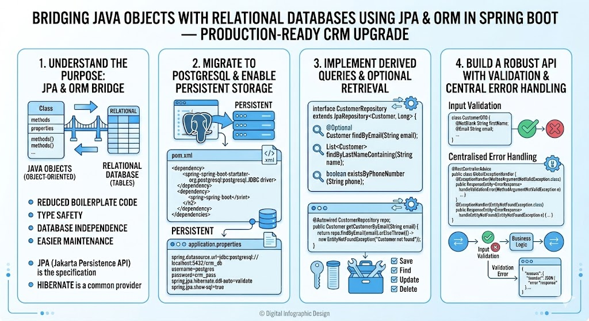

# [3.17] Persistent Data Management and Robust API Design

## Lesson Overview

## Dependencies

- [Self Studies](./studies.md) / [Lesson](./lesson.md) / [Assignment](./assignment.md) / [Slide Deck](./slides.md)

## Lesson Objectives

By the end of this lesson, students will be able to:

* **Switch** from H2 to PostgreSQL and configure Spring Data JPA for persistent storage
* **Implement** JPA derived queries and use `Optional` for safer data retrieval
* **Centralise** error handling and enforce input validation to build a robust, production-ready API

## Lesson Plan

| Duration | What | How or Why |
|---|---|---|
| 10 min | Warm-up | Recap H2, JPA entities, and `JpaRepository` from Lesson 3.16 — students are extending the same project |
| 20 min | Part 1: PostgreSQL setup | Install PostgreSQL (WSL/Mac), configure DBeaver, create `simple_crm` database |
| 15 min | Part 2: Switch from H2 to PostgreSQL | Swap dependency and update `application.properties`; verify tables appear in DBeaver — demonstrate database portability of JPA |
| 15 min | Part 3: JPA Derived Queries | Code-along — add `findByFirstName` to repository; add service method and `/search` endpoint; show how Spring generates SQL from method names |
| 15 min | Part 4: Optional and safer lookups | Explain `Optional`; refactor `getCustomer` to use `isPresent()` then simplify with `orElseThrow()`; demonstrate the problem with `.get()` on missing records |
| 10 min | Break | — |
| 20 min | Part 5: Global Exception Handler | Code-along — create `GlobalExceptionHandler` with `@ControllerAdvice`; add `ErrorResponse` class; clean up controller `try-catch` blocks; add general `Exception` handler |
| 15 min | Activity 1 — InteractionNotFoundException + refactor | Students add `InteractionNotFoundException`, refactor service layer, and update global handler to use array notation |
| 20 min | Part 6: Validation | Add `spring-boot-starter-validation`; annotate `Customer` with `@NotBlank` and `@Email`; add `@Valid` to controller; add `MethodArgumentNotValidException` handler |
| 10 min | Activity 2 — Add validation constraints | Students add constraints for `yearOfBirth`, `contactNo`, `remarks`, and `interactionDate` |
| 10 min | Wrap-up | Recap PostgreSQL switch, derived queries, Optional, global exception handler, and validation — all building blocks of a production-ready API |
| **180 min** | **Total** | |